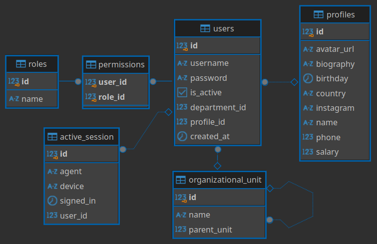

# Using multiples Databases

Using Oracle DB 11g and PostgreeSQL

### ER Diagram



### History of commands

```bash
# Install SDKMAN
curl -s "https://get.sdkman.io" | bash

# Install JDK
sdk install java

# Install maven
sdk install maven

# Start containter with Oracle and PostgreSQL
docker compose up -d

# Use DBeaver to create tables using schema.sql

# Oracle 11g
# URL: jdbc:oracle:thin:@//localhost:1521
# User: SYSTEM
# Pass: oracle
# Schema: MULTIDB
# Schema pass: MULTIDB

# Postgres URL:
# jdbc:postgresql://localhost:5432/relationships
# User: postgres
# Pass: password
```

### Test with Swagger

[http://localhost:8080/swagger-ui/index.html](http://localhost:8080/swagger-ui/index.html)